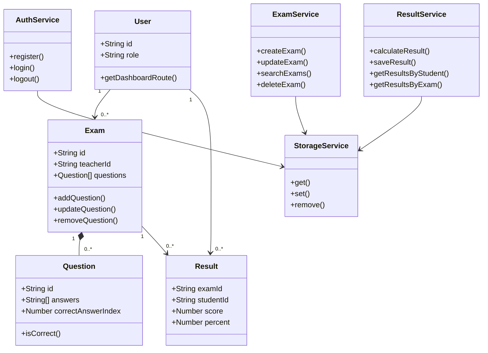
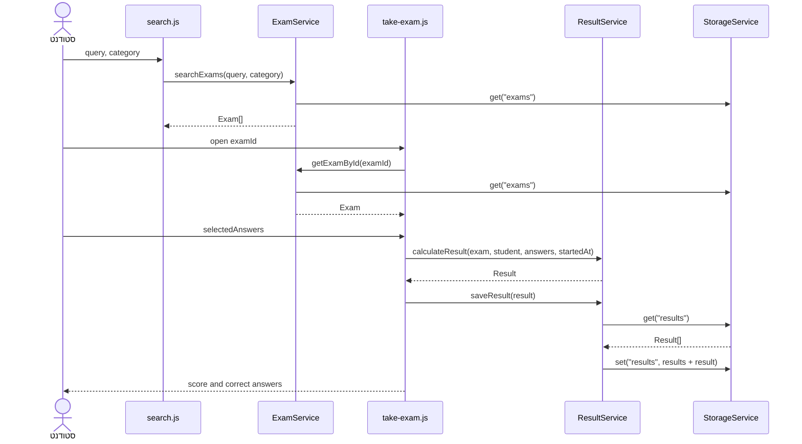

# QuizProj - מסמך טכני

מערכת מבחנים צד לקוח המבוססת על ES Modules, מחלקות OOP, JSON ו-`localStorage`. שרת Node.js עם Express מגיש את תיקיית `client/` ומספק routes נקיים.

## כתובות GitHub ו-Deploy

- GitHub: <https://github.com/ebraheem222-tech/QuizProj>
- Deploy - GitHub Pages: <https://ebraheem222-tech.github.io/QuizProj/>
- הרצה מקומית: <http://localhost:3000>

```bash
npm install
npm start
```

יש לפתוח את `http://localhost:3000` ולא להשתמש ב-`file://`, כדי ש-ES Modules ונתיבי Express יעבדו כראוי.

## דפים באתר והניווט ביניהם

| דף | נתיב Express | ניווט מרכזי |
|---|---|---|
| דף ראשי | `/` | מעבר להרשמה או להתחברות |
| הרשמה | `/register` | לאחר הרשמה: מורה עובר ל-`/teacher`, סטודנט ל-`/student` |
| התחברות | `/login` | מעבר לדשבורד המתאים לפי תפקיד המשתמש |
| דף מורה | `/teacher` | יצירת מבחן ומעבר לניהול מבחן ב-`/exam/:id` |
| פרטי מבחן | `/exam/:id` | עריכת מבחן, ניהול שאלות וצפייה בתוצאות |
| דף סטודנט | `/student` | היסטוריית ציונים ומעבר לחיפוש מבחן |
| חיפוש מבחן | `/search` | בחירת מבחן ומעבר ל-`/take/:id` |
| ביצוע מבחן | `/take/:id` | שליחת תשובות, הצגת ציון וחזרה לדף הסטודנט |

כפתור ההתנתקות נמצא בכותרת הדפים. הוא מוחק את `quizproj.currentUserId` ומחזיר את המשתמש לדף הראשי. ב-GitHub Pages אותם דפים זמינים כקובצי HTML תחת `client/pages/`.

## פורמט הנתונים הנשמרים ב-JSON

כל מאפיין ראשי בדוגמה מייצג מפתח נפרד ב-`localStorage`. השירות ממיר את נתוני המערכת באמצעות `JSON.stringify` ו-`JSON.parse`; ערך העיצוב נשמר כמחרוזת רגילה.

```json
{
  "quizproj.users": [
    {
      "id": "user-id",
      "fullName": "שם המשתמש",
      "nationalId": "123456789",
      "email": "user@example.com",
      "password": "1234",
      "role": "student",
      "createdAt": "2026-07-11T10:00:00.000Z"
    }
  ],
  "quizproj.currentUserId": "user-id",
  "quizproj.exams": [
    {
      "id": "exam-id",
      "teacherId": "teacher-id",
      "title": "JavaScript Basics",
      "description": "מבחן לדוגמה",
      "category": "JavaScript",
      "code": "JS-101",
      "durationMinutes": 15,
      "shuffleQuestions": true,
      "questions": [
        {
          "id": "question-id",
          "text": "מהי המטרה של localStorage?",
          "answers": ["שמירת נתונים", "עיצוב", "שרת", "שליחת אימייל"],
          "correctAnswerIndex": 0,
          "difficulty": "easy"
        }
      ],
      "createdAt": "2026-07-11T10:00:00.000Z",
      "updatedAt": "2026-07-11T10:00:00.000Z"
    }
  ],
  "quizproj.results": [
    {
      "id": "result-id",
      "examId": "exam-id",
      "examTitle": "JavaScript Basics",
      "studentId": "user-id",
      "studentName": "שם המשתמש",
      "answers": [
        {
          "questionId": "question-id",
          "questionText": "מהי המטרה של localStorage?",
          "answerIndex": 0,
          "selectedAnswer": "שמירת נתונים",
          "correctAnswerIndex": 0,
          "correctAnswer": "שמירת נתונים",
          "isCorrect": true
        }
      ],
      "score": 1,
      "totalQuestions": 1,
      "percent": 100,
      "startedAt": "2026-07-11T10:00:00.000Z",
      "submittedAt": "2026-07-11T10:02:00.000Z",
      "durationSeconds": 120
    }
  ],
  "quizproj.theme": "light"
}
```

הסיסמאות נשמרות כטקסט רגיל מפני שזהו פרויקט לימודי הפועל בדפדפן בלבד. במערכת אמיתית יש לבצע אימות ושמירת סיסמאות בצד שרת.

## המחלקות העיקריות - UML



## FLOW מרכזי - סטודנט מבצע מבחן

התרשים מציג מי קורא למי ומה עובר בין המודולים בתהליך המרכזי:



הקלט המרכזי הוא `{ questionId: answerIndex }`. הפלט הוא אובייקט `Result`, הנשמר ב-`quizproj.results` ומוצג בדף הסטודנט ובתוצאות המורה.
