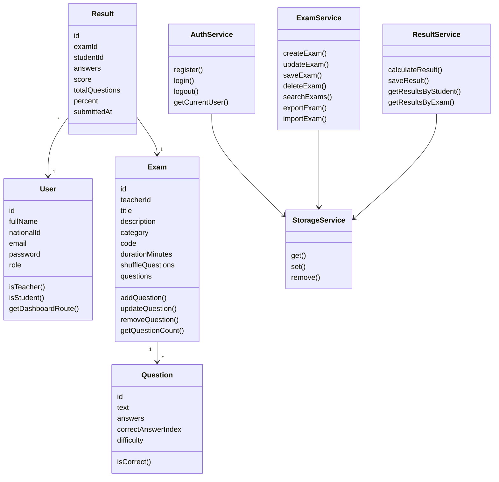
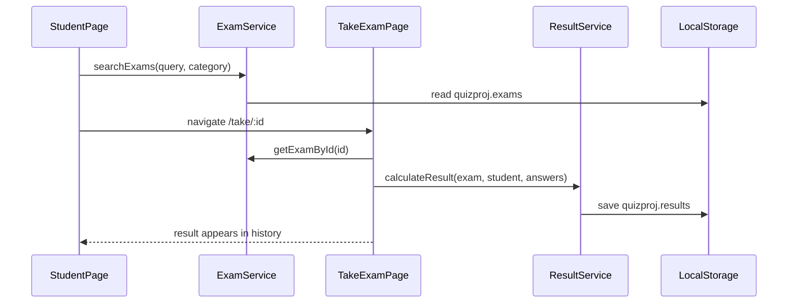
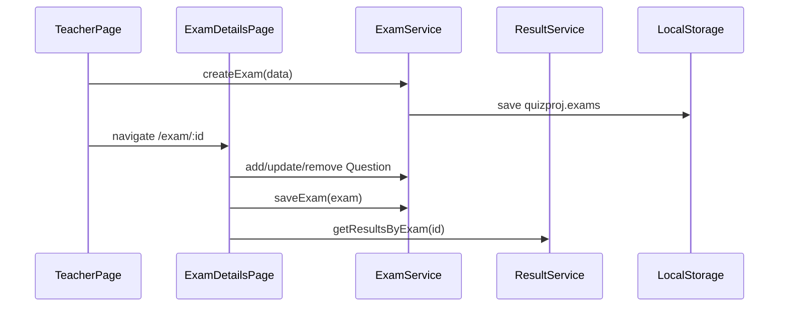

# QuizProj - מערכת מבחנים צד לקוח

מערכת מבחנים מלאה שפועלת בדפדפן בלבד ושומרת נתונים ב-`localStorage` בפורמט JSON.  
הפרויקט משתמש ב-ES Modules, מחלקות OOP, שירותים מופרדים, ושרת Node.js Express שמגיש את תיקיית `client` כאתר סטטי עם routes נקיים.

המסמך המלא להגשה, כולל ניווט, JSON, UML ותזרימי מערכת: [TECHNICAL_DOCUMENT.md](TECHNICAL_DOCUMENT.md)

קובצי הגשה מוכנים:

- [מסמך טכני PDF](docs/QuizProj_TECHNICAL_DOCUMENT.pdf)
- [תרשים UML כ-SVG](docs/UML_DIAGRAM.svg)
- [תרשים UML כ-PNG](docs/UML_DIAGRAM.png)

ליצירה מחדש של קובצי ההגשה לאחר שינוי המסמך:

```bash
npm run docs
```

ליצירה מחדש של תרשים ה-UML בלבד:

```bash
npm run docs:uml
```

## קישורים

- GitHub: https://github.com/ebraheem222-tech/QuizProj
- GitHub Pages: https://ebraheem222-tech.github.io/QuizProj/
- הרצה מקומית עם Node: `http://localhost:3000`

## הרצה

```bash
npm install
npm start
```

אחרי ההרצה פותחים בדפדפן:

```text
http://localhost:3000
```

אין לפתוח את האתר ישירות כקובץ `file://`, כי ES Modules ו-routes כמו `/register` צריכים שרת סטטי.

השרת מוגדר ב-`server.js` עם Express:

- `app.use(express.static(clientDir))` להגשת תיקיית `client/`.
- `app.use("/client", express.static(clientDir))` לתמיכה בנתיבי `/client/...`.
- `app.get(...)` עבור routes נקיים לדפי האתר.

Routes נתמכים:

- `/`
- `/login`
- `/register`
- `/teacher`
- `/exam/:id`
- `/student`
- `/search`
- `/take/:id`

ל-GitHub Pages נשמרת תמיכה גם בקבצי HTML רגילים תחת `client/`.

## משתמשי הדגמה

כאשר `localStorage` ריק, המערכת מוסיפה נתוני הדגמה:

| תפקיד | אימייל | סיסמה |
|---|---|---|
| מורה | `teacher@demo.com` | `1234` |
| סטודנט | `student@demo.com` | `1234` |

## פיצ'רים

- הרשמה ובחירת סוג משתמש: מורה או סטודנט.
- התחברות לפי אימייל או תעודת זהות.
- התנתקות מכל הדפים וחזרה לדף הראשי.
- אזור מורה: יצירת מבחנים, חיפוש מבחני המורה, מחיקה, ייצוא וייבוא JSON.
- דף פרטי מבחן: עריכת מידע כללי, ניהול שאלות, תשובות נכונות ורמות קושי.
- צפייה בתוצאות סטודנטים עבור מבחן.
- אזור סטודנט: היסטוריית מבחנים, ציונים קודמים, ממוצע, ציון גבוה ותשובות.
- חיפוש מבחן לפי שם, תיאור, קטגוריה או קוד.
- ביצוע מבחן אמריקאי, שמירת תוצאה, הצגת תשובות נכונות וציון מיידי.
- טיימר לפי משך מבחן.
- ערבוב סדר שאלות לפי הגדרת המורה.
- מצב כהה.

## מבנה קבצים

```text
QuizProj/
├── server.js
├── package.json
├── index.html
├── login.html
├── client/
│   ├── index.html
│   ├── pages/
│   │   ├── login.html
│   │   ├── register.html
│   │   ├── teacher.html
│   │   ├── exam-details.html
│   │   ├── student.html
│   │   ├── search.html
│   │   └── take-exam.html
│   └── assets/
│       ├── css/styles.css
│       └── js/
│           ├── models/
│           ├── services/
│           ├── ui/
│           ├── utils/
│           └── pages/
└── README.md
```

## מודלים ושירותים



## פורמט JSON ב-localStorage

המערכת משתמשת במפתחות:

- `quizproj.users`
- `quizproj.currentUserId`
- `quizproj.exams`
- `quizproj.results`
- `quizproj.theme`

דוגמת משתמש:

```json
{
  "id": "demo-student",
  "fullName": "סטודנט הדגמה",
  "nationalId": "222222222",
  "email": "student@demo.com",
  "password": "1234",
  "role": "student",
  "createdAt": "2026-07-10T00:00:00.000Z"
}
```

דוגמת מבחן:

```json
{
  "id": "demo-js-exam",
  "teacherId": "demo-teacher",
  "title": "JavaScript Basics",
  "description": "מבחן הדגמה קצר",
  "category": "JavaScript",
  "code": "JS-DEMO",
  "durationMinutes": 15,
  "shuffleQuestions": true,
  "questions": [
    {
      "id": "question-id",
      "text": "מהי המטרה של localStorage?",
      "answers": ["שמירת נתונים בדפדפן", "שליחת אימיילים", "שרת", "CSS"],
      "correctAnswerIndex": 0,
      "difficulty": "easy"
    }
  ],
  "createdAt": "2026-07-10T00:00:00.000Z",
  "updatedAt": "2026-07-10T00:00:00.000Z"
}
```

דוגמת תוצאה:

```json
{
  "id": "result-id",
  "examId": "demo-js-exam",
  "examTitle": "JavaScript Basics",
  "studentId": "demo-student",
  "studentName": "סטודנט הדגמה",
  "score": 2,
  "totalQuestions": 2,
  "percent": 100,
  "startedAt": "2026-07-10T10:00:00.000Z",
  "submittedAt": "2026-07-10T10:04:00.000Z",
  "durationSeconds": 240
}
```

## Flow מרכזי - סטודנט מבצע מבחן



## Flow מרכזי - מורה מנהל מבחן



## הערות

- הסיסמאות נשמרות כטקסט רגיל כי זה פרויקט לימודי צד לקוח בלבד.
- אין Backend אמיתי ואין בסיס נתונים חיצוני.
- מחיקת מבחן מוחקת גם את תוצאותיו דרך `ResultService`.
- השרת המקומי נועד ל-routes נקיים; GitHub Pages מגיש את אותם דפים בצורה סטטית.
