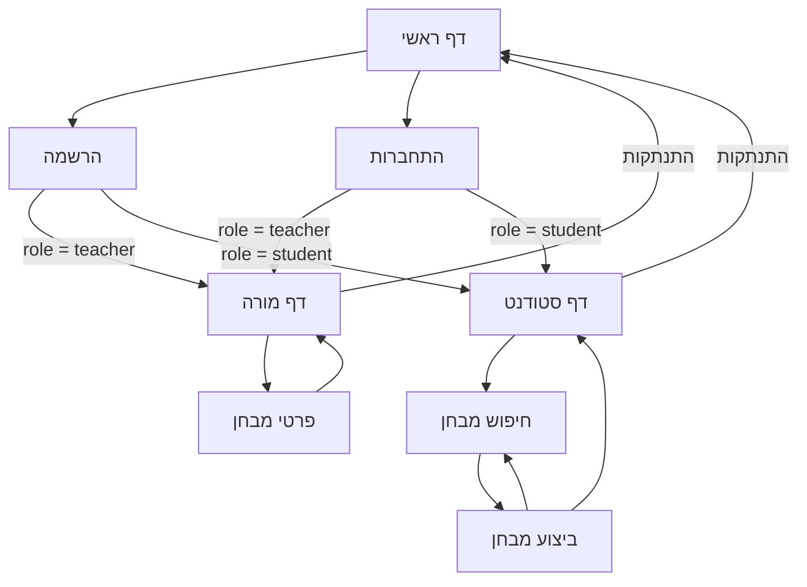
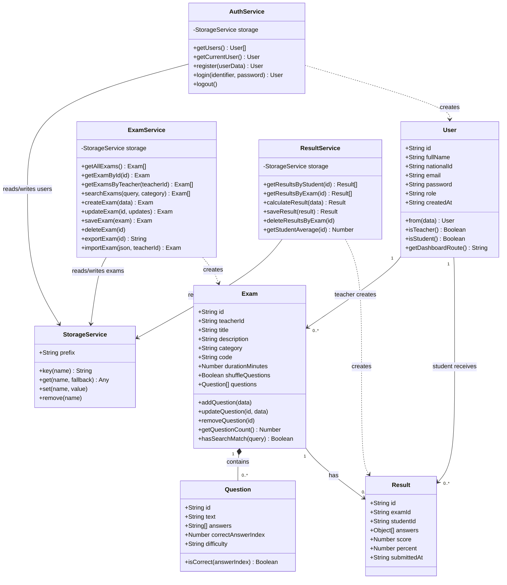
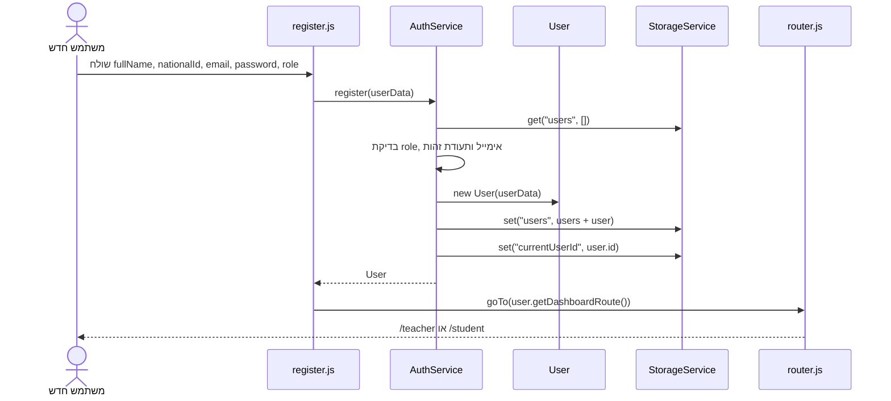
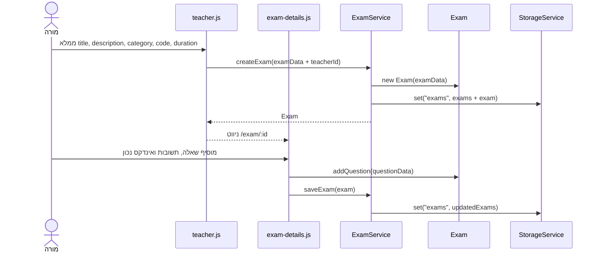
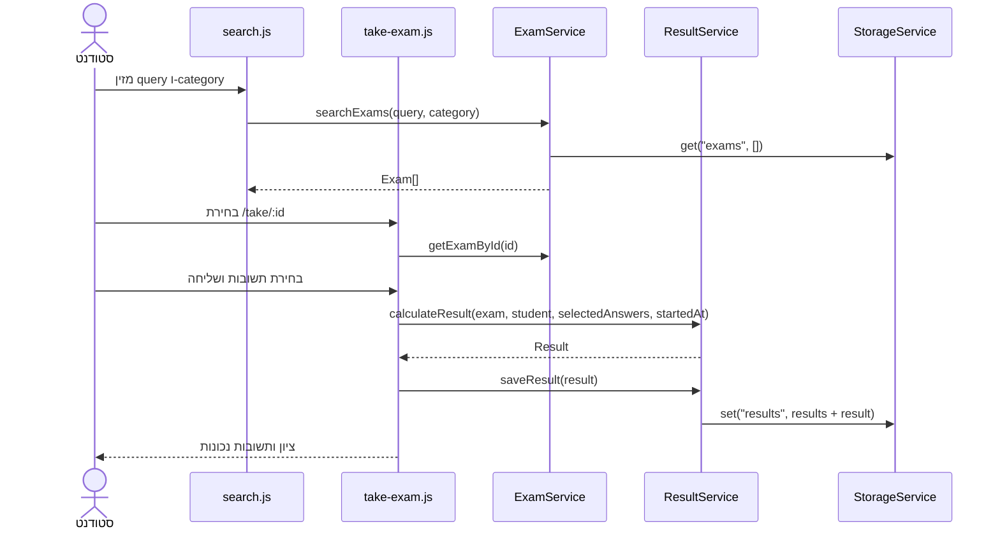
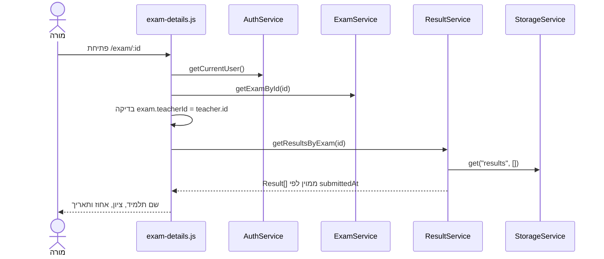

# מסמך טכני - QuizProj

## 1. פרטי הפרויקט וקישורים

**שם הפרויקט:** QuizProj - מערכת מבחנים צד לקוח  
**טכנולוגיות:** HTML, CSS, JavaScript, ES Modules, OOP, JSON, `localStorage`, Node.js ו-Express.

- קוד מקור ב-GitHub: <https://github.com/ebraheem222-tech/QuizProj>
- אתר GitHub Pages: <https://ebraheem222-tech.github.io/QuizProj/>
- כתובת בהרצה מקומית: <http://localhost:3000>

המערכת שומרת את המידע בדפדפן בלבד. שרת Express אינו שומר מידע ואינו כולל בסיס נתונים; תפקידו להגיש את תיקיית `client/` כאתר סטטי ולספק כתובות URL נקיות.

### הרצה מקומית

```bash
npm install
npm start
```

לאחר מכן פותחים בדפדפן את <http://localhost:3000>. אין לפתוח את הקבצים ישירות באמצעות `file://`, מפני ש-ES Modules ונתיבים כגון `/register` דורשים שרת HTTP.

---

## 2. דפי האתר והניווט ביניהם

| דף | נתיב Express מקומי | נתיב סטטי ב-GitHub Pages | הרשאה | תפקיד הדף |
|---|---|---|---|---|
| דף ראשי | `/` | `/QuizProj/client/index.html` | כולם | הצגת הפרויקט וקישורים להרשמה ולהתחברות |
| הרשמה | `/register` | `/QuizProj/client/pages/register.html` | אורח | יצירת משתמש מסוג מורה או סטודנט |
| התחברות | `/login` | `/QuizProj/client/pages/login.html` | אורח | התחברות באמצעות אימייל או תעודת זהות |
| דף מורה | `/teacher` | `/QuizProj/client/pages/teacher.html` | מורה | יצירה, חיפוש, מחיקה, ייבוא וייצוא של מבחנים |
| פרטי מבחן | `/exam/:id` | `/QuizProj/client/pages/exam-details.html?id=:id` | מורה בעל המבחן | עריכת מבחן, ניהול שאלות וצפייה בתוצאות |
| דף סטודנט | `/student` | `/QuizProj/client/pages/student.html` | סטודנט | היסטוריית מבחנים, ציונים וממוצע |
| חיפוש מבחן | `/search` | `/QuizProj/client/pages/search.html` | סטודנט | חיפוש לפי שם, תיאור, קטגוריה או קוד |
| ביצוע מבחן | `/take/:id` | `/QuizProj/client/pages/take-exam.html?id=:id` | סטודנט | מענה על שאלות, טיימר ושליחת התוצאה |

### מפת ניווט



המודול `router.js` יוצר את הכתובת המתאימה לסביבת ההרצה. בהרצה עם Node הוא מחזיר נתיב נקי, לדוגמה `/exam/123`. ב-GitHub Pages הוא מחזיר נתיב לקובץ HTML עם מזהה ב-query string, לדוגמה `exam-details.html?id=123`.

---

## 3. פורמט הנתונים הנשמרים כ-JSON

המחלקה `StorageService` מוסיפה את התחילית `quizproj.` לכל מפתח, ממירה אובייקטים ל-JSON באמצעות `JSON.stringify`, וקוראת אותם באמצעות `JSON.parse`.

| מפתח ב-`localStorage` | סוג הערך | תוכן |
|---|---|---|
| `quizproj.users` | מערך | משתמשים רשומים |
| `quizproj.currentUserId` | מחרוזת | מזהה המשתמש המחובר |
| `quizproj.exams` | מערך | מבחנים והשאלות שבתוכם |
| `quizproj.results` | מערך | ניסיונות וציוני תלמידים |
| `quizproj.theme` | מחרוזת | ערך `light` או `dark` |

### משתמש (`User`)

```json
{
  "id": "demo-student",
  "fullName": "סטודנט הדגמה",
  "nationalId": "222222222",
  "email": "student@demo.com",
  "password": "1234",
  "role": "student",
  "createdAt": "2026-07-10T00:00:00.000Z"
}
```

- `role` יכול להיות `teacher` או `student`.
- `id` נוצר באמצעות `crypto.randomUUID()`.
- בפרויקט לימודי זה הסיסמה נשמרת כטקסט רגיל. במערכת אמיתית יש לבצע אימות בצד שרת ולשמור hash בלבד.

### מבחן (`Exam`) ושאלה (`Question`)

```json
{
  "id": "demo-js-exam",
  "teacherId": "demo-teacher",
  "title": "JavaScript Basics",
  "description": "מבחן הדגמה קצר",
  "category": "JavaScript",
  "code": "JS-DEMO",
  "durationMinutes": 15,
  "shuffleQuestions": true,
  "questions": [
    {
      "id": "question-id",
      "text": "מהי המטרה של localStorage?",
      "answers": [
        "שמירת נתונים בדפדפן",
        "שליחת אימיילים",
        "הרצת שרת",
        "עיצוב CSS"
      ],
      "correctAnswerIndex": 0,
      "difficulty": "easy"
    }
  ],
  "createdAt": "2026-07-10T00:00:00.000Z",
  "updatedAt": "2026-07-10T00:00:00.000Z"
}
```

- `teacherId` מקשר את המבחן למורה שיצר אותו.
- `code` הוא קוד חיפוש ייחודי למבחן.
- `correctAnswerIndex` הוא מיקום התשובה הנכונה במערך `answers`, החל מ-0.
- `difficulty` יכול להיות `easy`, `medium` או `hard`.

### תוצאה (`Result`)

```json
{
  "id": "result-id",
  "examId": "demo-js-exam",
  "examTitle": "JavaScript Basics",
  "studentId": "demo-student",
  "studentName": "סטודנט הדגמה",
  "answers": [
    {
      "questionId": "question-id",
      "questionText": "מהי המטרה של localStorage?",
      "answerIndex": 0,
      "selectedAnswer": "שמירת נתונים בדפדפן",
      "correctAnswerIndex": 0,
      "correctAnswer": "שמירת נתונים בדפדפן",
      "isCorrect": true
    }
  ],
  "score": 1,
  "totalQuestions": 1,
  "percent": 100,
  "startedAt": "2026-07-10T10:00:00.000Z",
  "submittedAt": "2026-07-10T10:04:00.000Z",
  "durationSeconds": 240
}
```

בתוצאה נשמר snapshot של נוסח השאלה, התשובה שנבחרה והתשובה הנכונה. לכן ניתן להציג ניסיון ישן גם אם המורה עורך את המבחן לאחר ההגשה.

### קשרים בין הנתונים

- `Exam.teacherId` מפנה אל `User.id` של מורה.
- `Result.examId` מפנה אל `Exam.id`.
- `Result.studentId` מפנה אל `User.id` של סטודנט.
- `Result.answers[].questionId` מפנה אל `Question.id` שהיה קיים בזמן ההגשה.

---

## 4. המחלקות העיקריות - UML



### אחריות המחלקות

- `User`, `Exam`, `Question`, `Result`: מודלי הנתונים והפעולות ששייכות לאובייקט עצמו.
- `StorageService`: שכבת גישה יחידה ל-`localStorage` ולטיפול ב-JSON.
- `AuthService`: הרשמה, התחברות, התנתקות וקבלת המשתמש הנוכחי.
- `ExamService`: יצירה, עריכה, חיפוש, מחיקה, ייבוא וייצוא של מבחנים.
- `ResultService`: חישוב ציון, שמירת ניסיון, שליפת היסטוריה וחישוב ממוצע.
- מודולי `pages/`: קוראים את הטפסים והאירועים מה-DOM ומפעילים את השירות המתאים.

---

## 5. תזרימי מערכת מרכזיים

### FLOW 1 - הרשמה והפניה לפי תפקיד



המידע שעובר: אובייקט `userData`. הפלט הוא אובייקט `User` והנתיב נקבע לפי `role`.

### FLOW 2 - מורה יוצר ועורך מבחן



המידע שעובר: `examData`, מזהה המורה, ובהמשך `questionData`. המבחן כולו נשמר מחדש במערך `quizproj.exams`.

### FLOW 3 - סטודנט מחפש ומבצע מבחן



המידע שעובר: מחרוזת חיפוש, קטגוריה, מזהה מבחן ומפה מסוג `{ questionId: answerIndex }`. הפלט הוא אובייקט `Result` מלא.

### FLOW 4 - מורה צופה בתוצאות תלמידים



---

## 6. מבנה הפרויקט

```text
QuizProj/
|-- server.js                 # שרת Express ונתיבי app.get
|-- package.json              # תלויות ופקודות npm
|-- README.md                 # הוראות ופיצ'רים
|-- TECHNICAL_DOCUMENT.md     # מסמך זה
|-- client/
|   |-- index.html
|   |-- pages/                # דפי מורה, סטודנט, הרשמה, התחברות ומבחנים
|   `-- assets/
|       |-- css/styles.css
|       `-- js/
|           |-- models/       # מחלקות User, Exam, Question, Result
|           |-- services/     # Auth, Exam, Result, Storage, Seed
|           |-- pages/        # לוגיקת DOM לכל דף
|           |-- ui/           # תפריט, מצב כהה והודעות
|           `-- utils/        # ניווט, HTML וייצוא קבצים
`-- index.html                # הפניה לתיקיית client עבור GitHub Pages
```

## 7. הערות ארכיטקטורה

- המערכת פועלת ללא Backend עסקי: אין API ואין מסד נתונים.
- Express מוגדר ב-`server.js` עם `express.static(clientDir)` ועם `app.get` לכל דף.
- ה-DI מתבצע באמצעות בנאי השירותים, לדוגמה `new AuthService(storage)`. כאשר לא מעבירים שירות אחסון, נוצר `StorageService` כברירת מחדל.
- `SeedService` מוסיף משתמשי הדגמה ומבחן לדוגמה רק כאשר האחסון ריק.
- גישה לדפי תפקיד נבדקת מול המשתמש המחובר. מורה יכול לנהל רק מבחן שה-`teacherId` שלו שווה למזהה המורה.
- מחיקת מבחן כוללת גם מחיקת התוצאות המקושרות אליו.

